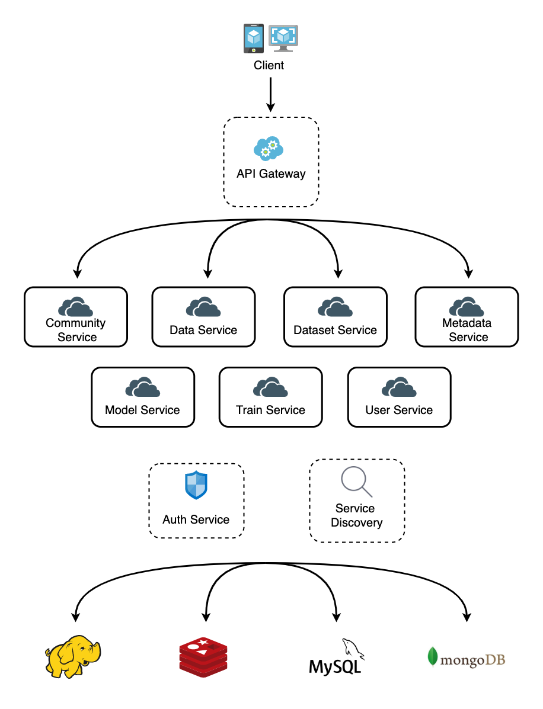

# MLab

**A machine learning platform with Vue and Spring Cloud**

This is backend repository and you can find frontend codes in [frontend](https://github.com/TayloreZhou/MLab-Front-end-).

## Overview

This project constructs a platform for machine learning, from training to discussion. There are three modules:

### Training Platform

A data-flow based GUI machine learning platform.

### Forum

A forum for Q&A or sharing experience about machine learning.

### Data Society

A community for people to discover data and share analysis.

## Technology Stack

* Spring Cloud
  * Eureka
  * Zuul
  * Feign
  * Security
  * OAuth
* HDFS
* MongoDB
* Redis
* MySQL
* RabbitMQ
* Swagger
* ......

## Architecture

## TODO

There are a lot of problems in this project, not only redundant business logic, but also unreasonable architecture. But as the course is over and something unpleasant happend on the team, no one knows when the plan of refactoring will be completed.

- [ ] Train Service uses Spark MLib to train a model. Actually, Spark MiLib is somewhat too simple and the pipeline in it is terrible. So the business logic of training can be rewritten.
- [ ] The number of micro-service is unreasonable. The service may be redivided by following the rule of Domain Drive Design (DDD).
- [ ] The frontend is incompleted. Because of limited time, some function even cannot communicate with backend. Moreover, the structure and code style of frontend is quite terrible. Write a new frontend may be better.

